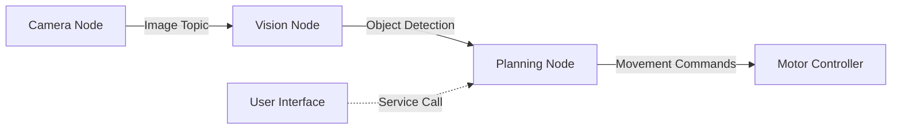

# ROS 2 Fundamentals

## 🏗️ ROS 2 Architecture

ROS 2 is built on a **distributed computing** model where multiple independent processes (called **nodes**) communicate with each other. This architecture provides flexibility, modularity, and fault tolerance.

### Core Concepts



## 🔷 Nodes

**Nodes** are the fundamental building blocks of ROS 2. Each node is an independent process that performs a specific task.

### Why Use Nodes?

- **Modularity**: Each node has a single responsibility
- **Fault Isolation**: If one node crashes, others continue running
- **Reusability**: Nodes can be reused across different robots
- **Scalability**: Distribute nodes across multiple machines

### Creating Your First Node

```python
import rclpy
from rclpy.node import Node

class MinimalNode(Node):
    def __init__(self):
        super().__init__('minimal_node')
        self.get_logger().info('Hello from ROS 2!')

def main(args=None):
    rclpy.init(args=args)
    node = MinimalNode()
    rclpy.spin(node)
    node.destroy_node()
    rclpy.shutdown()

if __name__ == '__main__':
    main()
```

:::tip Node Naming
Choose descriptive node names like `camera_processor` or `path_planner` instead of generic names like `node1`.
:::

## 📡 Topics

**Topics** implement a **publish-subscribe** pattern for continuous data streams. Multiple nodes can publish to or subscribe from the same topic.

### How Topics Work

```python
# Publisher Node
import rclpy
from rclpy.node import Node
from std_msgs.msg import String

class PublisherNode(Node):
    def __init__(self):
        super().__init__('publisher_node')
        self.publisher = self.create_publisher(String, 'robot_status', 10)
        self.timer = self.create_timer(1.0, self.publish_status)
        self.counter = 0

    def publish_status(self):
        msg = String()
        msg.data = f'Robot is active: {self.counter}'
        self.publisher.publish(msg)
        self.get_logger().info(f'Publishing: {msg.data}')
        self.counter += 1

def main(args=None):
    rclpy.init(args=args)
    node = PublisherNode()
    rclpy.spin(node)
    node.destroy_node()
    rclpy.shutdown()
```

```python
# Subscriber Node
import rclpy
from rclpy.node import Node
from std_msgs.msg import String

class SubscriberNode(Node):
    def __init__(self):
        super().__init__('subscriber_node')
        self.subscription = self.create_subscription(
            String,
            'robot_status',
            self.listener_callback,
            10
        )

    def listener_callback(self, msg):
        self.get_logger().info(f'Received: {msg.data}')

def main(args=None):
    rclpy.init(args=args)
    node = SubscriberNode()
    rclpy.spin(node)
    node.destroy_node()
    rclpy.shutdown()
```

### Topic Communication Patterns

| Pattern | Use Case | Example |
|---------|----------|---------|
| **1:1** | Direct communication | Camera → Vision processor |
| **1:N** | Broadcasting | Sensor → Multiple analyzers |
| **N:1** | Data aggregation | Multiple sensors → Fusion node |
| **N:N** | Complex systems | Distributed robot swarm |

:::info Quality of Service (QoS)
ROS 2 uses QoS policies to control message delivery. The number `10` in `create_publisher(String, 'topic', 10)` is the queue size for reliability.
:::

## 🔧 Services

**Services** implement a **request-response** pattern for occasional, synchronous operations.

### When to Use Services vs Topics

- **Topics**: Continuous data (sensor readings, robot state)
- **Services**: Occasional requests (start/stop, configuration changes)

### Creating a Service

```python
# Service Server
from example_interfaces.srv import AddTwoInts
import rclpy
from rclpy.node import Node

class ServiceServer(Node):
    def __init__(self):
        super().__init__('add_two_ints_server')
        self.srv = self.create_service(
            AddTwoInts,
            'add_two_ints',
            self.add_two_ints_callback
        )

    def add_two_ints_callback(self, request, response):
        response.sum = request.a + request.b
        self.get_logger().info(f'Request: {request.a} + {request.b} = {response.sum}')
        return response

def main(args=None):
    rclpy.init(args=args)
    node = ServiceServer()
    rclpy.spin(node)
    rclpy.shutdown()
```

```python
# Service Client
from example_interfaces.srv import AddTwoInts
import rclpy
from rclpy.node import Node

class ServiceClient(Node):
    def __init__(self):
        super().__init__('add_two_ints_client')
        self.client = self.create_client(AddTwoInts, 'add_two_ints')
        while not self.client.wait_for_service(timeout_sec=1.0):
            self.get_logger().info('Waiting for service...')

    def send_request(self, a, b):
        request = AddTwoInts.Request()
        request.a = a
        request.b = b
        future = self.client.call_async(request)
        return future

def main(args=None):
    rclpy.init(args=args)
    node = ServiceClient()
    future = node.send_request(5, 7)
    rclpy.spin_until_future_complete(node, future)
    result = future.result()
    node.get_logger().info(f'Result: {result.sum}')
    node.destroy_node()
    rclpy.shutdown()
```

## ⚡ Actions

**Actions** are for long-running tasks that need **feedback** and can be **preempted** (cancelled).

### Action Use Cases

- Navigation to a goal (with progress updates)
- Grasping an object (with force feedback)
- Following a trajectory (with position updates)

### Action Structure

```python
from action_tutorials_interfaces.action import Fibonacci
import rclpy
from rclpy.action import ActionServer
from rclpy.node import Node

class FibonacciActionServer(Node):
    def __init__(self):
        super().__init__('fibonacci_action_server')
        self._action_server = ActionServer(
            self,
            Fibonacci,
            'fibonacci',
            self.execute_callback
        )

    def execute_callback(self, goal_handle):
        self.get_logger().info('Executing goal...')
        
        feedback_msg = Fibonacci.Feedback()
        feedback_msg.sequence = [0, 1]

        for i in range(1, goal_handle.request.order):
            feedback_msg.sequence.append(
                feedback_msg.sequence[i] + feedback_msg.sequence[i-1]
            )
            self.get_logger().info(f'Feedback: {feedback_msg.sequence}')
            goal_handle.publish_feedback(feedback_msg)

        goal_handle.succeed()
        result = Fibonacci.Result()
        result.sequence = feedback_msg.sequence
        return result

def main(args=None):
    rclpy.init(args=args)
    node = FibonacciActionServer()
    rclpy.spin(node)
    rclpy.shutdown()
```

## 🗂️ ROS 2 Workspace Structure

A typical ROS 2 workspace follows this structure:

```
workspace/
├── src/
│   ├── package1/
│   │   ├── package.xml
│   │   ├── setup.py
│   │   ├── package1/
│   │   │   ├── __init__.py
│   │   │   └── node.py
│   └── package2/
├── build/
├── install/
└── log/
```

### Creating a Workspace

```bash
# Create workspace
mkdir -p ~/ros2_ws/src
cd ~/ros2_ws/src

# Create a package
ros2 pkg create --build-type ament_python my_robot_pkg

# Build the workspace
cd ~/ros2_ws
colcon build

# Source the workspace
source install/setup.bash
```

## 🎯 Key Takeaways

1. **Nodes** are independent processes that perform specific tasks
2. **Topics** enable publish-subscribe communication for continuous data
3. **Services** provide request-response patterns for occasional operations
4. **Actions** support long-running tasks with feedback and cancellation
5. ROS 2 architecture promotes **modularity**, **reusability**, and **scalability**

## 🧪 Practice Exercise

Try creating a simple system with:
- A **publisher node** that sends random sensor data
- A **subscriber node** that processes the data
- A **service** that can reset the sensor
- An **action** that calibrates the sensor over time

:::tip Next Steps
Now that you understand ROS 2 fundamentals, let's learn how to integrate Python AI agents with ROS 2 in the next chapter!
:::

---

**Next**: [Python Agents with ROS 2 →](./python-agents)
