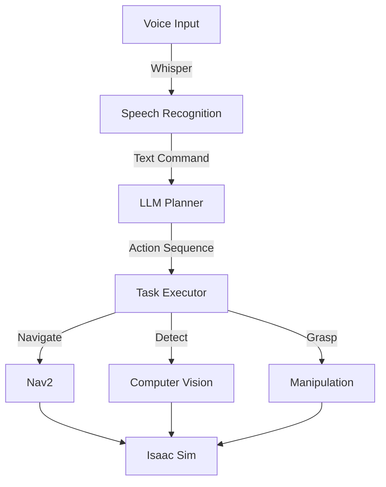

# Capstone Project: The Autonomous Humanoid

## 🎯 Project Overview

Build a complete autonomous humanoid system that:
1. ✅ Receives voice commands
2. ✅ Plans tasks using LLMs
3. ✅ Navigates around obstacles
4. ✅ Identifies objects with computer vision
5. ✅ Manipulates objects to complete tasks

## 🏗️ System Architecture



## 📝 Complete Implementation

### Main Controller

```python
#!/usr/bin/env python3
import rclpy
from rclpy.node import Node
from rclpy.executors import MultiThreadedExecutor
from std_msgs.msg import String
import whisper
import openai
import json

class AutonomousHumanoid(Node):
    def __init__(self):
        super().__init__('autonomous_humanoid')
        
        # Initialize components
        self.whisper_model = whisper.load_model("base")
        openai.api_key = "your-api-key"
        
        # Publishers
        self.action_pub = self.create_publisher(String, '/robot_action', 10)
        
        # State
        self.current_task = None
        self.task_status = 'idle'
        
        self.get_logger().info('🤖 Autonomous Humanoid System Ready!')
    
    def listen_for_command(self):
        """Listen for voice command"""
        self.get_logger().info('🎤 Listening for command...')
        
        # Record and transcribe (simplified)
        audio = self.record_audio()
        result = self.whisper_model.transcribe(audio)
        command = result["text"]
        
        self.get_logger().info(f'📝 Heard: "{command}"')
        return command
    
    def plan_task(self, command):
        """Use LLM to plan task"""
        self.get_logger().info('🧠 Planning task...')
        
        prompt = f"""
        Command: "{command}"
        
        Generate a detailed action plan for a humanoid robot.
        Available actions:
        - navigate_to(x, y, theta)
        - scan_for_objects()
        - approach_object(object_id)
        - grasp_object()
        - release_object()
        - return_home()
        
        Return JSON array of actions.
        """
        
        response = openai.ChatCompletion.create(
            model="gpt-4",
            messages=[
                {"role": "system", "content": "You are a robot task planner."},
                {"role": "user", "content": prompt}
            ]
        )
        
        plan = json.loads(response.choices[0].message.content)
        self.get_logger().info(f'📋 Plan: {len(plan)} actions')
        return plan
    
    def execute_plan(self, plan):
        """Execute the action plan"""
        self.get_logger().info('⚡ Executing plan...')
        
        for i, action in enumerate(plan):
            self.get_logger().info(f'Step {i+1}/{len(plan)}: {action["type"]}')
            
            # Execute action
            success = self.execute_action(action)
            
            if not success:
                self.get_logger().error(f'❌ Action failed: {action["type"]}')
                return False
        
        self.get_logger().info('✅ Task completed successfully!')
        return True
    
    def execute_action(self, action):
        """Execute a single action"""
        action_type = action['type']
        params = action.get('params', {})
        
        if action_type == 'navigate_to':
            return self.navigate(params['x'], params['y'], params.get('theta', 0))
        elif action_type == 'scan_for_objects':
            return self.scan_objects()
        elif action_type == 'grasp_object':
            return self.grasp()
        elif action_type == 'release_object':
            return self.release()
        
        return True
    
    def navigate(self, x, y, theta):
        """Navigate to position"""
        self.get_logger().info(f'🚶 Navigating to ({x}, {y})')
        # Use Nav2 navigator here
        return True
    
    def scan_objects(self):
        """Scan for objects using computer vision"""
        self.get_logger().info('👁️ Scanning for objects')
        # Use object detection here
        return True
    
    def grasp(self):
        """Grasp object"""
        self.get_logger().info('🤲 Grasping object')
        # Execute grasping sequence
        return True
    
    def release(self):
        """Release object"""
        self.get_logger().info('✋ Releasing object')
        # Execute release sequence
        return True
    
    def run(self):
        """Main execution loop"""
        while rclpy.ok():
            try:
                # Listen for command
                command = self.listen_for_command()
                
                # Plan task
                plan = self.plan_task(command)
                
                # Execute plan
                self.execute_plan(plan)
                
            except KeyboardInterrupt:
                break
            except Exception as e:
                self.get_logger().error(f'Error: {e}')

def main():
    rclpy.init()
    
    humanoid = AutonomousHumanoid()
    
    try:
        humanoid.run()
    except KeyboardInterrupt:
        pass
    finally:
        humanoid.destroy_node()
        rclpy.shutdown()

if __name__ == '__main__':
    main()
```

## 🧪 Testing Scenarios

### Scenario 1: "Pick up the red box"
1. Voice command recognized
2. LLM plans: scan → navigate → grasp → return
3. Robot executes each step
4. Success confirmation

### Scenario 2: "Clean the table"
1. Identify objects on table
2. Plan multi-step cleanup
3. Navigate to each object
4. Grasp and place in designated area

### Scenario 3: "Bring me a water bottle"
1. Search environment for water bottle
2. Navigate to bottle location
3. Grasp bottle
4. Navigate to user
5. Hand over bottle

## 🎯 Success Criteria

- ✅ Voice commands recognized with >90% accuracy
- ✅ LLM generates valid action plans
- ✅ Robot navigates collision-free
- ✅ Object detection identifies targets
- ✅ Grasping succeeds on first attempt
- ✅ Complete task end-to-end

## 🏆 Congratulations!

You've built a complete autonomous humanoid system integrating:
- Voice recognition
- Cognitive planning
- Navigation
- Perception
- Manipulation

**This is the future of Physical AI!** 🚀

---

**Next**: [Hands-On Lab →](./hands-on-lab)
